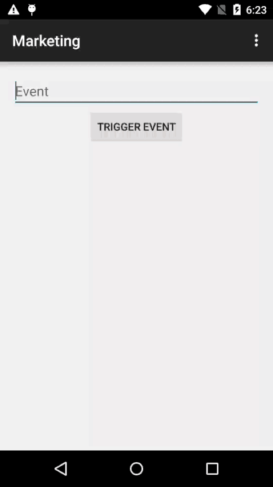

# LAS-Demo-Marketing-Android

## Overview

Auth is a sample of LAS SDK, and it relies on the basic module of LAS. This app shows the third-party operation based on LAS SDK.


## Effect



## How to Use

1. Open Android Studio or IDEA, click `File -> Open `, select and import `setting.gradle`. 
2. Open `App.java` and replace the defined constants with your own `APP Id` and `API KEY`. 
3. Config the Marketing message on console after the app is totally closed off, then you can check the matched messages on opening the app. 
4. You can get the list of all messages pulled from server by tapping the  `Test Mode` on ActionBar.

## Customize

### Marketing

#### Show Marketing Message

1. The Activity that requires Marketing messages must be inherited from FragmentActivity.

2. Invoke following code in `onResume()` 

```java
LASMarketing.setInAppMessageDisplayActivity(this);`。
```

#### Close Marketing Message

```java
LASMarketing.dismissCurrentInAppMessage();
LASMarketing.clearInAppMessageDisplayActivity();
```

#### Open Test Mode

Test mode can show all the message lists pulled from server and help users modify the interface. Please remember to delete the code before officially releasing the product.

Add following code in `AndroidManifest.xml`

```java
<activity android:name="as.leap.internal.marketing.TestMessageListActivity"/>
```

Invoke following code to open test mode

```java
LASMarketing.openTestMode(this);
```

#### Config Close Button

The Close button is on the right side by default. You can add following code to set it on the left

```java
LASMarketing.setInAppDismissButtonLocation(LASMarketing.InAppMessageDismissButtonLocation.LEFT);
```

If you are not satisfied with the display effect of Close button, you can add following code to disable it

```java
LASMarketing.setInAppMessageDismissButtonImage(bitmap);
```

### Push

#### Config Permission

You need to add following permission in `AndroidManifest.xml` before using Push

```xml
<!-- your package -->
<permission
    android:name="yourPackageName.permission.C2D_MESSAGE"
    android:protectionLevel="signature" />
<uses-permission android:name="yourPackageName.permission.C2D_MESSAGE" />

<!-- App receives GCM messages. -->
<uses-permission android:name="com.google.android.c2dm.permission.RECEIVE" />
<!-- GCM requires a Google account. -->
<uses-permission android:name="android.permission.GET_ACCOUNTS" />
<!-- Keeps the processor from sleeping when a message is received. -->
<uses-permission android:name="android.permission.WAKE_LOCK" />

<application ...>
    <!-- play services -->
    <meta-data
        android:name="com.google.android.gms.version"
        android:value="@integer/google_play_services_version" />

    <receiver
    android:name="as.leap.push.GcmBroadcastReceiver"
    android:permission="com.google.android.c2dm.permission.SEND">
    <intent-filter>
        <action android:name="com.google.android.c2dm.intent.RECEIVE" />
        <action android:name="com.google.android.c2dm.intent.REGISTRATION" />

        <category android:name="yourPackageName" />
    </intent-filter>
    </receiver>
</application>
```

Please replace `yourPackageName` in aforementioned xml with app package name.

#### Config SenderId

Use "," to add multiple sendIDs at the same time（eg：`android:value="id:senderId01,senderId02,sender03"`）

```xml
<meta-data
    android:name="as.leap.push.gcm_sender_id"
    android:value="id:senderId01" />
```

#### Config Notification Icon

SDK will use the app icon as the notification icon by default if there's no configuration.

```xml
<meta-data
    android:name="as.leap.push.notification_icon"
    android:resource="@android:drawable/ic_dialog_alert" />
```

#### Config PushReceiver

PushReceiver is used to handle Push messages and show Notifications.

```xml
<receiver android:name="as.leap.LASPushBroadcastReceiver" android:exported="false">
    <intent-filter>
        <action android:name="as.leap.push.intent.RECEIVE"/>
        <action android:name="as.leap.push.intent.OPEN"/>
    </intent-filter>
</receiver>
```

#### Customize PushReceiver

If you are not satisfied with the default PushReceiver, you can customize it to replace the default one by inheriting LASPushBroadcastReceiver. 

AndroidManifest.xml

```xml
<receiver
    android:name=".CustomPushReceiver"
    android:exported="false">
    <intent-filter>
        <action android:name="as.leap.push.intent.RECEIVE" />
        <action android:name="as.leap.push.intent.OPEN" />
    </intent-filter>
</receiver>
```

Java

```java
public class CustomPushReceiver extends LASPushBroadcastReceiver {
}
```

You can override the parent class's methods to customize the handling behavior of Push Notifications after you customized your PushReceiver.


##### Customize the Activity Jumped from Notification

```java
protected Class<? extends Activity> getActivity(Intent intent)
```

After returns with non-null value, it will jump to the certian Activity if tapped on the Notification. You can get the information that Push carries in that Activity with `getIntent()` 

```java
Intent intent = getIntent();
if (intent != null && intent.getExtras() != null) {
    for (String key : intent.getExtras().keySet()) {
        LASLog.i(TAG, key + " = " + intent.getStringExtra(key));
    }
}
```

#####  Customize the Uri Jumped from Notification

```java
protected Uri getUri(Intent intent)
```

After returns with non-null value, it will jump to the certian Uri if tapped on the Notification.

Notice: getActivity() has a higher priority than getUri(). If getActivity（）doesn't return null, then getUri() will be ignored.


##### Customize Notification LargeIcon

```java
 protected Bitmap getLargeIcon(Context context)
```

##### Customize Notificatioin SmallIcon

```java
protected int getSmallIconId(Context context)
```

Or, config in `AndroidManifest.xml` as aforementioned

```xml
<meta-data
    android:name="as.leap.push.notification_icon"
    android:resource="@android:drawable/ic_dialog_alert" />
```

##### Modify Intent

If you want to modify the Intent info got by tapping on the Notification (like the Intent Flag), please override following code 

```java
@Override
protected void startIntent(Context context, Intent intent) {
	// Modify Intent Flag Info
    intent.setFlags(Intent.FLAG_ACTIVITY_NEW_TASK);
    super.startIntent(context, intent);
}
```

##### Completely Customize Notification

If you want to create Notification object all by yourself, please override following method

```java
protected Notification getNotification(Context context, Intent intent)
```


